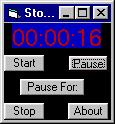



## A StopWatch

### Description

This Is a StopWatch or timer I made for very new programmers with vb. It has the stopwatch function, pause, pause for certain amount of time and stop and start. It displays 00:00:00 with seconds, minutes, and hours, it will even msgbox you when u get through a whole day on that. By Feet on 1/3/2001 at about 2 A.M. :x. Fully Commented.
 
### More Info
 
to use it u need to put the stop watch sub in a timer with an interval at about 950 seconds(maybe a little less).

             |
---                |---
**Submitted On**   |2001-01-03 14:15:38
**By**             |[Feet](https://github.com/Planet-Source-Code/PSCIndex/blob/master/ByAuthor/feet.md)
**Level**          |Beginner
**User Rating**    |3.6 (25 globes from 7 users)
**Compatibility**  |VB 4\.0 \(32\-bit\), VB 5\.0, VB 6\.0
**Category**       |[Math/ Dates](https://github.com/Planet-Source-Code/PSCIndex/blob/master/ByCategory/math-dates__1-37.md)
**World**          |[Visual Basic](https://github.com/Planet-Source-Code/PSCIndex/blob/master/ByWorld/visual-basic.md)
**Archive File**   |[CODE\_UPLOAD13312132001\.zip](https://github.com/Planet-Source-Code/feet-a-stopwatch__1-14069/archive/master.zip)

